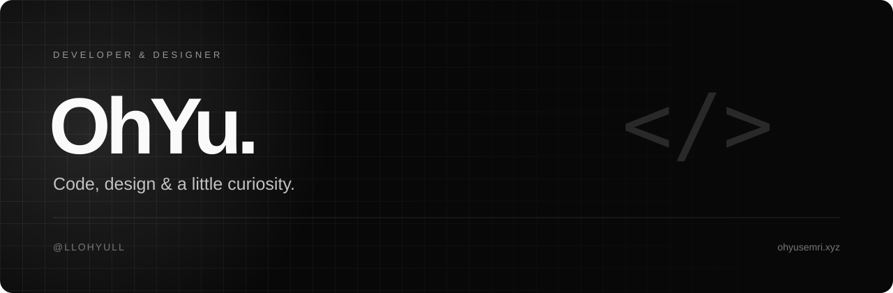
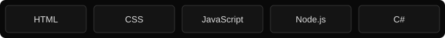

  

  <a href="https://ohyusemri.xyz"><strong>Website ↗</strong></a>
  &nbsp; · &nbsp;
  <a href="https://github.com/llohyull"><strong>GitHub ↗</strong></a>
  &nbsp; · &nbsp;
  <a href="https://discord.com/users/1429982972081209525"><strong>Discord ↗</strong></a>

 

## About me.

I'm **OhYu**, a developer and designer from Brazil. I like turning ideas into interfaces, experimenting with code and making the things I build feel good to use.

My interests include web development, desktop launchers, game-related tools and interface design. I enjoy clean layouts, dark themes and subtle animation — small details that make a project feel personal.

I'm still learning, refining my work and exploring new ways to bring ideas to life.

 

## My toolkit.

  

| Area | What I enjoy working on |
| :--- | :--- |
| **Web development** | Personal websites, interactive pages and responsive interfaces. |
| **Interface design** | Dark themes, typography, visual details and lightweight motion. |
| **Applications** | Launchers, tools and interfaces that connect useful features. |
| **Experimentation** | Trying ideas, learning from problems and improving existing projects. |

 

## Work.

My repositories are where I share code, experiments and projects as they develop.

**[Explore my repositories →](https://github.com/llohyull?tab=repositories)**

For a visual overview, visit **[my portfolio](https://ohyusemri.xyz)**. It brings my public GitHub projects together in one place, with descriptions and links to the source code.

 

## What I'm exploring.

- Building more polished and responsive interfaces.
- Improving my JavaScript and Node.js skills.
- Connecting design, animation and practical functionality.
- Making projects easier to navigate and use.

 

## Let's connect.

Have a question about a project, an idea to share or something interesting to build? Find me here:

| | Link |
| :--- | :--- |
| **Website** | [ohyusemri.xyz](https://ohyusemri.xyz) |
| **GitHub** | [@llohyull](https://github.com/llohyull) |
| **Discord** | [Message me on Discord](https://discord.com/users/1429982972081209525) |

 

  

